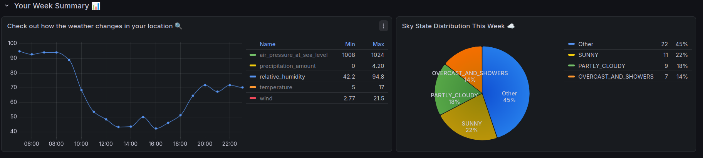
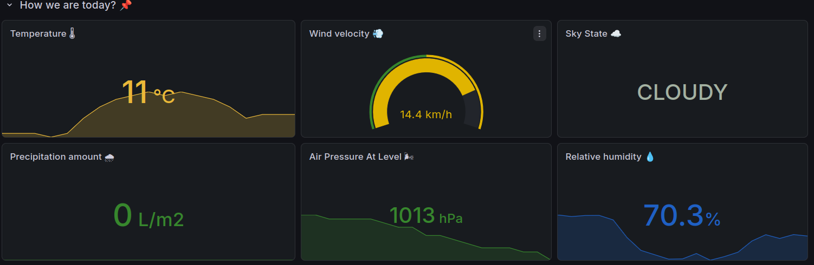
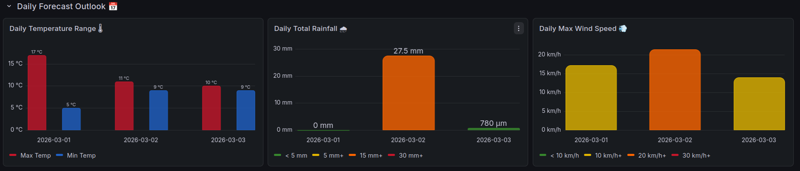
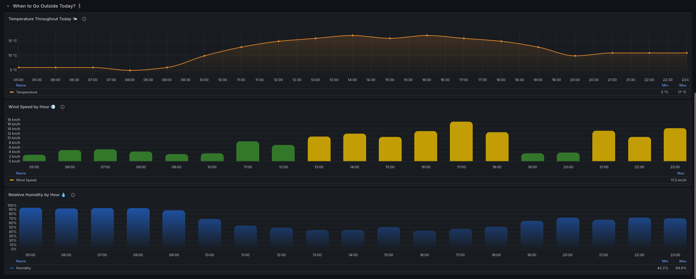

# WeatherDataGaliza Dashboard
# Panel de monitorización meteorológica adaptado a tu ubicación actual

Conocer el tiempo que hará en los próximos días debería ser inmediato, independientemente de dónde te encuentres. **WeatherDataGaliza** es un sistema de visualización meteorológica que detecta tu ubicación actual mediante tu dirección IP, consulta la previsión de MeteoGalicia para tus coordenadas y la presenta en un dashboard interactivo de Grafana, todo de manera automática.

El proyecto surge en el contexto del **HackUDC 2026** con el objetivo de eliminar la fricción entre los datos meteorológicos técnicos y el usuario final: sin configuración manual de coordenadas, sin formatos difíciles de interpretar.

## <u>DESARROLLO</u>

#### BACKEND EN PYTHON

El núcleo de la aplicación está compuesto por tres servicios independientes que se orquestan desde la clase `WeatherApp`:

**1. Geolocalización por IP**

Mediante la API de [ipgeolocation.io](https://ipgeolocation.io), el servicio `IPGeolocationService` obtiene las coordenadas (latitud y longitud), ciudad y país asociados a la dirección IP del dispositivo en el momento de la ejecución. Este proceso es completamente transparente para el usuario.

**2. Previsión meteorológica**

El servicio `WeatherForecastService` consulta la **API v5 de MeteoGalicia** para obtener la previsión horaria de las próximas 48 horas para las coordenadas obtenidas en el paso anterior. Las variables recuperadas son:

<table>
  <tr>
    <th>Variable</th>
    <th>Descripción</th>
  </tr>
  <tr>
    <td>sky_state</td>
    <td>Estado del cielo (despejado, nublado, lluvia, etc.)</td>
  </tr>
  <tr>
    <td>temperature</td>
    <td>Temperatura del aire (°C)</td>
  </tr>
  <tr>
    <td>wind</td>
    <td>Velocidad del viento (km/h)</td>
  </tr>
  <tr>
    <td>precipitation_amount</td>
    <td>Cantidad de precipitación acumulada (mm)</td>
  </tr>
  <tr>
    <td>relative_humidity</td>
    <td>Humedad relativa (%)</td>
  </tr>
  <tr>
    <td>air_pressure_at_sea_level</td>
    <td>Presión atmosférica a nivel del mar (hPa)</td>
  </tr>
</table>

**3. Caché de ubicación y base de datos local**

Para evitar llamadas innecesarias a las APIs externas, la aplicación implementa un sistema de caché doble:

- `LocationCache` — detecta si la ubicación ha cambiado respecto a la última ejecución y si los datos almacenados han expirado.
- `WeatherDB` — almacena las observaciones meteorológicas en una base de datos SQLite local mediante el patrón DAO, con consultas SQL pre-definidas en `queries.json`.

Solo se realizan nuevas peticiones a las APIs cuando la ubicación cambia o los datos expiran.

#### DASHBOARD EN GRAFANA

El dashboard está organizado en cuatro secciones con distintos niveles de detalle:

**Visión general semanal**

Dos paneles en la parte superior ofrecen una lectura rápida de la semana: una **serie temporal** con la evolución horaria de todas las variables y un **gráfico de tarta** que muestra la proporción de horas por estado del cielo, agrupando en *"Other"* los estados menos frecuentes para mantener la legibilidad.



**¿Cómo estamos hoy?** *(sección colapsable)*

Seis paneles de estadísticas (stat y gauge) con umbrales de color muestran el estado actual de cada variable meteorológica: temperatura, viento, estado del cielo, precipitación, presión atmosférica y humedad relativa.




**Daily Forecast Outlook** *(sección colapsable)*

Tres gráficos de barras agregan los datos por día: rango de temperatura (mínima y máxima), precipitación total y velocidad máxima del viento. Permite comparar los días de la semana de un solo vistazo.




**¿Cuándo salir hoy?** *(sección colapsable)*

Tres paneles apilados verticalmente a pantalla completa muestran la evolución horaria de temperatura (curva suavizada con relleno), viento (barras coloreadas por umbral) y humedad relativa (gradiente azul continuo), respondiendo directamente la pregunta de en qué franja horaria es más conveniente salir.




## <u>Librerías principales</u>

<table>
  <tr>
    <th>Nombre</th>
    <th>Versión</th>
    <th>Propósito</th>
  </tr>
  <tr>
    <td>numpy</td>
    <td>2.4.2</td>
    <td>Operaciones numéricas sobre arrays</td>
  </tr>
  <tr>
    <td>pandas</td>
    <td>3.0.1</td>
    <td>Procesamiento y transformación de datos meteorológicos</td>
  </tr>
  <tr>
    <td>python-dotenv</td>
    <td>1.2.1</td>
    <td>Gestión de variables de entorno (API keys)</td>
  </tr>
  <tr>
    <td>requests</td>
    <td>2.32.5</td>
    <td>Comunicación HTTP con las APIs externas</td>
  </tr>
</table>

## <u>Herramientas de visualización</u>

<table>
  <tr>
    <th>Nombre</th>
    <th>Versión</th>
    <th>Propósito</th>
  </tr>
  <tr>
    <td>Grafana</td>
    <td>12.4.0</td>
    <td>Plataforma de visualización del dashboard</td>
  </tr>
  <tr>
    <td>Infinity Datasource</td>
    <td>3.7.2</td>
    <td>Ingesta y parseo de datos CSV en línea</td>
  </tr>
</table>

```bash
# Crear entorno virtual e instalar dependencias Python
python3 -m venv venv
source venv/bin/activate
pip install -r requirements.txt

# Instalar plugins de Grafana
grafana-cli plugins install yesoreyeram-infinity-datasource

# Reiniciar el servicio de Grafana
sudo systemctl restart grafana-server
```

Crea un archivo `.env` en la raíz del proyecto con las siguientes claves:

```
API_MG=<tu_api_key_de_meteogalicia>
API_IP=<tu_api_key_de_ipgeolocation>
```

---

## <u>Licencia del proyecto</u>

Este proyecto se distribuye bajo la licencia **MIT**. Todas las dependencias Python utilizan licencias permisivas (BSD-3-Clause, Apache 2.0), compatibles con MIT. Grafana, aunque distribuido bajo AGPL-3.0, se emplea como herramienta externa sin modificación de su código fuente, por lo que su copyleft no se propaga al proyecto.

## <u>Licencias de dependencias</u>

<table>
  <tr>
    <th>Nombre</th>
    <th>Licencia</th>
  </tr>
  <tr>
    <td>numpy</td>
    <td>BSD-3-Clause</td>
  </tr>
  <tr>
    <td>pandas</td>
    <td>BSD-3-Clause</td>
  </tr>
  <tr>
    <td>requests</td>
    <td>Apache License 2.0</td>
  </tr>
  <tr>
    <td>Grafana</td>
    <td>AGPL-3.0</td>
  </tr>
  <tr>
    <td>yesoreyeram-infinity-datasource</td>
    <td>Apache License 2.0</td>
  </tr>

</table>

---
